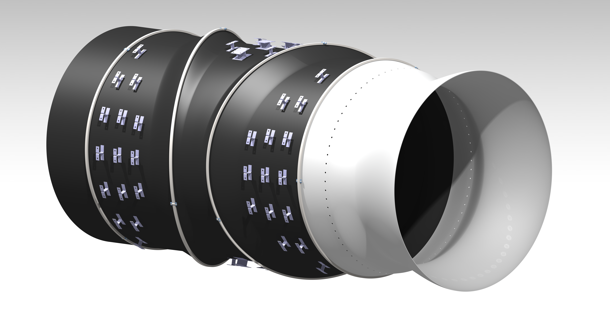
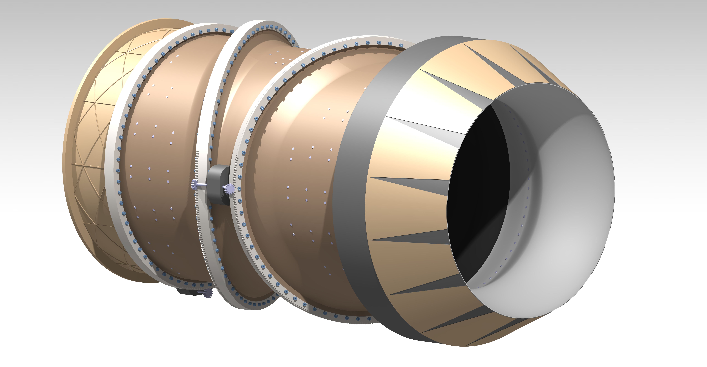

# Design and Kinematic Simulation of a Thrust Vectoring Nozzle

Showcase of the design and simulation of the vectoring nozzle inspired by the Pratt & Whitney F135-PW-600, the engine of the Lockheed Martin F-35 Lightning II. The project has been carried out using CATIA V5. For additional information see `PRESENTATION.pdf`.

## Geometry

The assembly is mainly constituted by three sub-assemblies, that are two non-axisymmetric ducts, one internal and one external; and the exhaust nozzle.

See the rendering of the ducts here:

## Drawing

## Kinematic Simulation

See the animation of the kinematics here:

## CATIA V5 files

To download or see the CAD files see the `FILES/` directory.